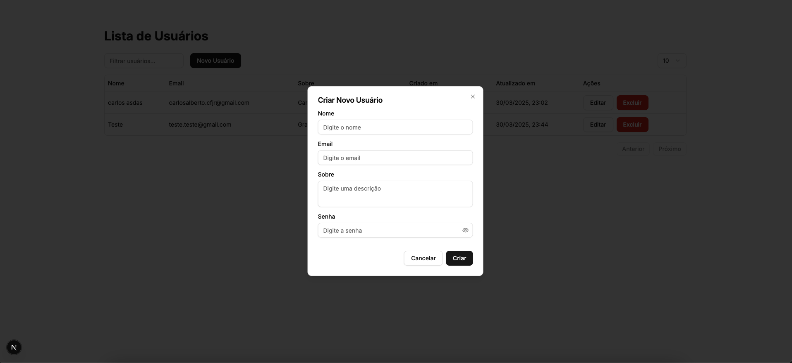
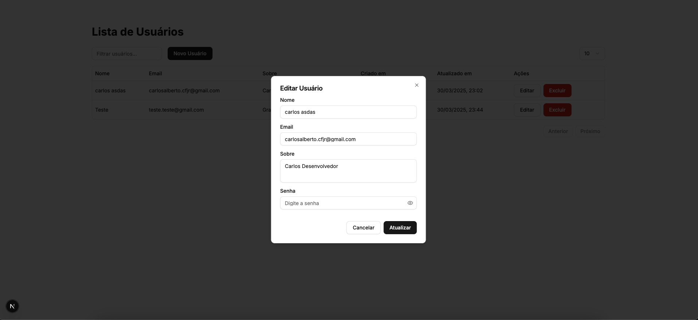
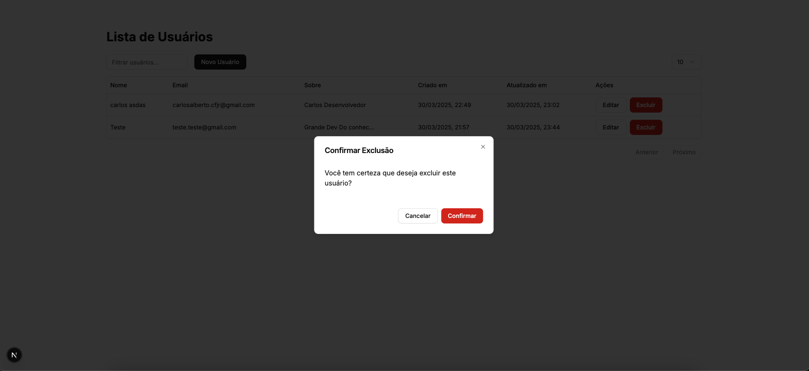

# Challenge Mouts Frontend

Este é um projeto desenvolvido com [Next.js](https://nextjs.org), que é um framework React para construção de aplicações web modernas. O projeto é uma aplicação de gerenciamento de usuários, permitindo a criação, edição e exclusão de usuários, além de exibir uma tabela com informações dos usuários.

## Funcionalidades

- **Gerenciamento de Usuários**: Criação, edição e exclusão de usuários.
- **Interface Intuitiva**: Uma interface de usuário amigável que facilita a interação com os dados.
- **Modais**: Utilização de modais para ações de edição e exclusão, melhorando a experiência do usuário.
- **Tooltip**: Exibição de informações adicionais através de tooltips em campos de texto longos.

## Tecnologias Utilizadas

- **Next.js**: Framework React para construção de aplicações web.
- **TypeScript**: Linguagem que adiciona tipagem estática ao JavaScript, melhorando a manutenção do código.
- **React Hook Form**: Biblioteca para gerenciamento de formulários em React.
- **Zod**: Biblioteca para validação de esquemas de dados.
- **TanStack Table**: Biblioteca para criação de tabelas altamente personalizáveis.
- **Shadcn UI**: Conjunto de componentes de interface de usuário para React.
- **React Query**: Biblioteca para gerenciamento de estado e sincronização de dados com o servidor.

## Screenshoots





## Como Rodar o Projeto

1. **Clone o repositório**:

   ```bash
   git clone <URL_DO_REPOSITORIO>
   cd <NOME_DO_DIRETORIO>
   ```

2. **Crie o arquivo `.env`**:

   - Copie o arquivo `.env.example` para criar um novo arquivo `.env`:

   ```bash
   cp .env.example .env
   ```

   - Edite o arquivo `.env` com as configurações apropriadas para o seu ambiente.

3. **Instale as dependências**:

   ```bash
   npm install
   # ou
   yarn install
   # ou
   pnpm install
   ```

4. **Inicie o servidor de desenvolvimento**:

   ```bash
   npm run dev
   # ou
   yarn dev
   # ou
   pnpm dev
   ```

5. **Acesse a aplicação**:
   Abra [http://localhost:3000](http://localhost:3000) no seu navegador para ver o resultado.

**Nota:** É necessário que o backend da aplicação esteja rodando localmente para que todas as funcionalidades do frontend funcionem corretamente. Certifique-se de que o servidor backend esteja ativo e acessível.

[Projeto de Backend](https://github.com/Fox-Carlinhos/mouts-challenge-back)

## Deploy no Vercel

A maneira mais fácil de implantar sua aplicação Next.js é usar a [Plataforma Vercel](https://vercel.com/new?utm_medium=default-template&filter=next.js&utm_source=create-next-app&utm_campaign=create-next-app-readme) dos criadores do Next.js.

Consulte nossa [documentação de implantação do Next.js](https://nextjs.org/docs/app/building-your-application/deploying) para mais detalhes.
